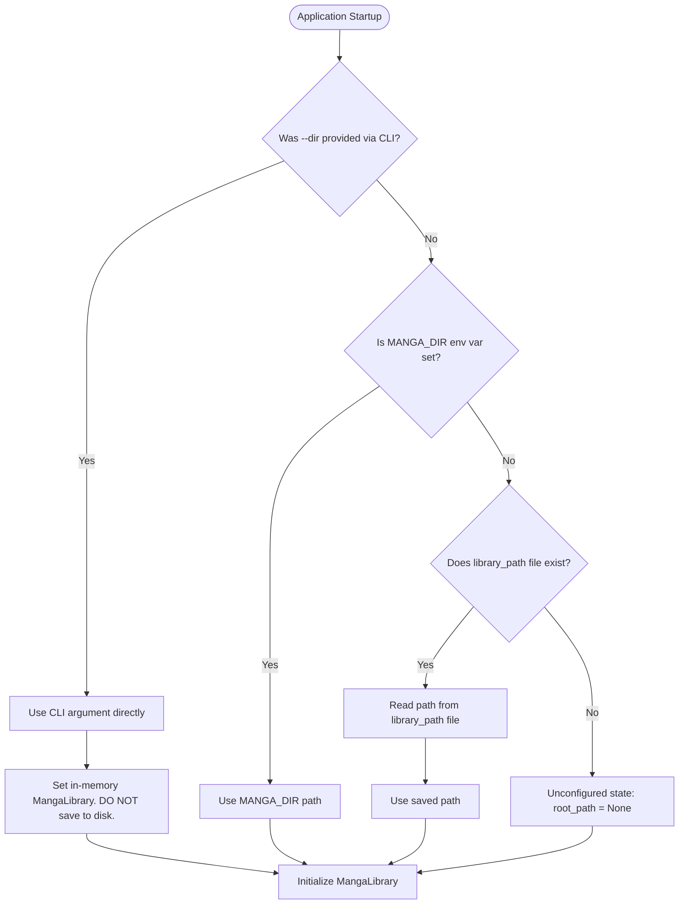

# PROJECT_CONTEXT.md: Local Manga & Manhwa Reader (`{ index }`)

Technical documentation of the current codebase architecture, implementation, storage, network APIs, platform integrations, and operational procedures.

---

## 1. Project Overview

### Name & Identity
- **Application Name**: `{ index }` (Local Manga & Manhwa Reader).
- **Favicon Artwork**: Japanese calligraphic **本** (hon / book / source) emblem with white strokes and a thick black sumi-e ink outline on a transparent canvas (`static/index-mark.svg`).
- **Browser Tab Title**: `{ index }`.

### Core Purpose & Problem Solved
Desktop and web-based comic/manga readers often require heavy database engines, cloud accounts, proprietary libraries, or invasive file re-organizations. `{ index }` is a zero-dependency, local-first web server and client built entirely on the Python 3 standard library and vanilla HTML5/CSS3/ES6 JavaScript. It runs locally, directly reading images from standard directories or `.cbz` / `.zip` archives without extracting them to disk or moving existing collections.

### Current Capabilities
- **Flexible Chapter Discovery**:
  - Directory-based chapters (e.g. `Chapter 1/`, `001 - The Beginning/`, `Volume 1/`, `Any Name/`).
  - Archive-based chapters (`.cbz` and `.zip` files) read directly in-memory from archive streams without disk extraction.
  - Image files with natural numerical ordering (e.g. `1.jpg`, `02.png`, `10.webp`, `page_100.avif`).
  - Supported image types: JPEG (`.jpg`, `.jpeg`), PNG (`.png`), WebP (`.webp`), GIF (`.gif`), AVIF (`.avif`), BMP (`.bmp`). Magic byte detection validates raw payloads.
- **Reading Experience**:
  - Continuous vertical strip reader optimized for both Japanese manga (spaced pages) and Korean manhwa / vertical webtoons (seamless strips).
  - Dynamic interactive bottom progress timeline with segment hopping, hover preview, and auto-hiding.
  - Real-time page tracking via `IntersectionObserver` with auto-resuming to the last read page.
  - Fullscreen mode with browser-native and Safari fallback handling.
  - Comprehensive keyboard navigation (`Left`/`Right` arrows, `Home`, `End`, `F`, `B`, `S`, `Escape`).
  - Chapter-level bookmarking.
- **Library & Series Management**:
  - Dynamic client-side search with instant title filtering.
  - Unified library sorting: by Name, Chapters, or Unread count, in either Ascending or Descending order.
  - Chapter list sorting toggle (Ascending vs Descending order) with persistent user preference.
  - Series metadata editor: custom display title, author, summary, status (Ongoing, Completed, Hiatus), and external web links.
  - Custom series cover and atmospheric hero backdrop upload/removal.
  - In-app manga folder switching using native platform folder dialogs (`osascript` on macOS, PowerShell on Windows, `zenity`/`kdialog` on Linux).
- **User Profile & Themes**:
  - Local user profile with customizable display name and avatar image (persisted in user application data).
  - Minimal editorial dark UI with dual theme support: **Crimson** (`#E53935` accent) and **Kuromi** (`#9B7EDB` purple accent), sharing a unified neutral dark foundation (`#0E0E0E`).
- **Cross-Platform One-Click Launchers**:
  - macOS: `start-mac.command` (with native `osascript` folder selection, port detection, readiness polling, Safari launch, and graceful shutdown).
  - Windows: `start-windows.bat` (with PowerShell folder selection, default browser launch, and cleanup).
  - Linux: `start-linux.sh` (with `zenity`/`kdialog`/CLI selection and desktop browser launch).

### Current Limitations
- **Local Network Scope**: Listens by default on `127.0.0.1:8000`. Does not feature user authentication or remote multi-tenant permission controls.
- **Single Active Library**: Operates against one primary library root directory at a time (though switching libraries on the fly is fully supported).
- **Two-Level Hierarchy**: Requires the strict top-level directory layout: `Manga/` -> `Series Name/` -> `Chapter/` (directory, `.cbz`, or `.zip`). Nested sub-series groups (e.g. `Manga/Author/Series/`) are not currently discovered.
- **No Writing Inside Archives**: Metadata and reading progress for `.cbz`/`.zip` archives are stored alongside the series in `.reader/reader_data.json`, never mutating the archive files themselves.

---

## 2. Architecture

```
+---------------------------------------------------------------------------------+
|                                Browser Client                                    |
|                                                                                 |
|  index.html                                                                     |
|  ├── Minimal Dark Header: [ { index } ]                    [ User Profile v ]   |
|  ├── View 1: Library View (Search, Unified Sort, Series Grid, Cover Thumbnails) |
|  ├── View 2: Series View (Backdrop, Metadata, Chapter List, Order Toggle)        |
|  └── View 3: Reader View (Sticky Header, Vertical Strip, Segmented Timeline)    |
|                                                                                 |
|  app.js                                                                         |
|  ├── Hash Router (#/, #/series/:name, #/read/:name/:chapter)                   |
|  ├── IntersectionObserver (Page visibility & auto-resume)                       |
|  └── State & LocalStorage (Sort preferences, chapter ordering, theme)           |
+---------------------------------------+-----------------------------------------+
                                        | HTTP REST API & Static Assets
                                        v
+---------------------------------------------------------------------------------+
|                        Python 3 Standard Library Server                         |
|                                   (server.py)                                   |
|                                                                                 |
|  MangaRequestHandler (ThreadingHTTPServer, BaseHTTPRequestHandler)              |
|  ├── Security: Path traversal checks (_is_safe_child, is_safe_archive_member)   |
|  ├── Static Asset Dispatcher (/index.html, /style.css, /app.js, /index-mark.svg) |
|  ├── Image Streaming (Direct file streaming & zipfile in-memory buffer read)    |
|  └── JSON API Endpoints (/api/series, /api/chapters, /api/reader-data, etc.)   |
|                                                                                 |
|  MangaLibrary Model                                                             |
|  ├── Natural Sorting Engine (natural_sort_key)                                  |
|  ├── Cover & Background Fallback Resolver (background -> cover -> ch1/p1)       |
|  └── Atomic File Operations (.tmp write -> atomic replace)                      |
+--------------------+---------------------------------------+--------------------+
                     |                                       |
                     v                                       v
+------------------------------------+   +----------------------------------------+
|      User Config / State Dir       |   |             Manga Library              |
| (~/Library/Application Support/    |   |           (Any local folder)           |
|   LocalMangaReader/)               |   |                                        |
| ├── library_path (Plaintext path)  |   | Manga/                                 |
| ├── settings.json (Theme choice)   |   | └── Series Name/                       |
| ├── profile.json (User name)       |   |     ├── cover.jpg (optional)           |
| └── avatar.jpg (User image)        |   |     ├── background.jpg (optional)      |
+------------------------------------+   |     ├── Chapter 01/                    |
                                         |     │   ├── 001.jpg                    |
                                         |     │   └── 002.png                    |
                                         |     ├── Chapter 02.cbz (ZIP archive)   |
                                         |     └── .reader/                       |
                                         |         └── reader_data.json           |
                                         +----------------------------------------+
```

### Architectural Decisions
1. **Zero External Dependencies**: Standard library only (`http.server`, `urllib`, `json`, `pathlib`, `zipfile`, `os`, `sys`, `shutil`, `subprocess`). No `pip install`, `virtualenv`, or binary wheels required.
2. **Vanilla Web Technologies**: Standard ES6 JavaScript, HTML5 semantic elements, and modern CSS3 custom properties (`var(--...)`). No npm, Webpack, Babel, Vite, React, or frontend frameworks.
3. **Decoupled Configuration**: Persistent state outside the git repository and outside the user's manga collection prevents accidental git contamination and allows directory portability.
4. **Non-Invasive Archive Handling**: `.cbz` and `.zip` archives are treated identically to directory chapters. Bytes are extracted on-demand in memory and streamed directly to HTTP responses; no temporary files are written to `/tmp` or disk.

---

## 3. Technology Stack

- **Backend Runtime**: Python 3.10+ (Standard Library).
- **Core Modules**:
  - `http.server.ThreadingHTTPServer`: Multi-threaded HTTP server preventing image request blocking.
  - `http.server.BaseHTTPRequestHandler`: Low-level request dispatching.
  - `zipfile`: Streaming archive member discovery and decompression.
  - `pathlib.Path`: Object-oriented filesystem path resolution and traversal security.
  - `json`: Configuration and reader metadata serialization.
  - `urllib.parse`: Safe query parameter decoding and encoding.
- **Frontend Stack**:
  - HTML5 (Semantic tags, SVG icons, responsive viewport meta tags).
  - CSS3 (Flexbox, CSS Grid, Custom Properties, `@media (prefers-color-scheme)`, backdrop filters).
  - Modern ES6+ JavaScript (`async`/`await`, `fetch`, `IntersectionObserver`, `history`/`hashchange`).
  - Google Fonts: *Cormorant Garamond* (Serif editorial headers) and *Inter* (Clean sans-serif UI).
- **Development & Testing Tools**:
  - Python `unittest`: 107 regression test cases in `test_server.py`.
  - Node.js syntax compiler (`node -c static/app.js`): Static analysis of client code.
- **Intentionally Omitted**:
  - No database engines (SQLite, PostgreSQL, MongoDB, etc.).
  - No Python web frameworks (Flask, FastAPI, Django, Tornado).
  - No image processing libraries (Pillow, OpenCV, ImageMagick).
  - No JavaScript build pipelines (Node packages, npm, TypeScript, Vite, Webpack).

---

## 4. Complete Project File Structure

```text
local-manga-reader/
├── README.md               # User documentation, quick-start guide, and feature summary
├── PROJECT_CONTEXT.md      # Comprehensive technical context and architecture documentation
├── server.py               # Core multi-threaded Python server, REST API, and MangaLibrary model
├── test_server.py          # Complete unit test suite (107 tests covering server, API, security, launchers)
├── start-mac.command       # Double-clickable macOS launcher script (Finder / Safari integration)
├── start-linux.sh          # Linux shell launcher script (zenity/kdialog/CLI support)
├── start-windows.bat       # Windows batch launcher (PowerShell folder picker, default browser launch)
├── .gitignore              # Ignores temp files, python caches, and local configurations
├── assets/                 # Repository demonstration media (demo.gif, screenshots, background.gif)
│   ├── background.gif
│   ├── demo.gif
│   ├── library.png
│   ├── reader.png
│   └── series.png
└── static/                 # Static web assets served by server.py
    ├── index.html          # Single Page Application HTML shell
    ├── style.css           # Editorial styling, theme variables (Crimson, Kuromi), responsive layout
    ├── app.js              # Client routing, API client, progress tracking, and UI interaction
    └── index-mark.svg      # Favicon: Stylized 本 character with white strokes, black outline, transparent bg
```

### Component Roles & Dependencies

| File | Purpose | Depends On | Depended On By | Key Symbols / Exports |
| :--- | :--- | :--- | :--- | :--- |
| `server.py` | Core backend server & API | Python 3 stdlib, `static/` files | Launchers (`start-*`), `test_server.py` | `MangaLibrary`, `MangaRequestHandler`, `run_server`, `get_config_dir` |
| `static/app.js` | Client state, UI logic, routing | DOM API, `/api/*` backend | `static/index.html` | `handleRoute`, `loadLibrary`, `loadChapters`, `loadReader`, `updateTheme` |
| `static/style.css`| Styling & themes | CSS Variables | `static/index.html` | `:root`, `[data-theme="crimson"]`, `[data-theme="kuromi"]`, `.reader-image` |
| `static/index.html`| SPA markup structure | `style.css`, `app.js`, `index-mark.svg` | Browser HTTP client | `#view-library`, `#view-chapters`, `#view-reader`, `#modal-profile` |
| `static/index-mark.svg`| Browser tab favicon | SVG XML Standard | `index.html` (`<link rel="icon">`) | Stylized calligraphic **本** with transparent background |
| `start-mac.command`| macOS double-clickable launcher | Bash, `osascript`, `curl`, `python3` | End user on macOS | `choose_folder_with_osascript`, `cleanup` trap |
| `test_server.py` | Test suite & verification | Python `unittest`, `server.py` | CI / Developers | 107 test cases verifying all subsystems |

---

## 5. Server Implementation (`server.py`)

### Server Startup & Argument Parsing
`server.py` defines `main()` which parses command-line arguments via `argparse`:
- `--dir`, `-d` (`str`, default: `DEFAULT_LIBRARY_DIR`): Path to the manga library folder.
- `--port`, `-p` (`int`, default: `8000`): Port to bind the HTTP server to.

When launched via CLI:
```bash
python3 server.py --dir /path/to/manga --port 8000
```
- If `--dir` is supplied, `run_server()` instantiates `MangaLibrary(library_dir=args.dir)`.
- **CRITICAL BEHAVIOR**: Passing `--dir` on the command line sets the library path for that runtime instance only. It does **not** overwrite the saved configuration file (`library_path`).
- If `--dir` is omitted, `DEFAULT_LIBRARY_DIR` resolves via `get_default_library_dir()`:
  1. `$MANGA_DIR` environment variable (if set).
  2. Content of the persistent config file `library_path` (if present).
  3. Returns `None` if unconfigured (there is no default/fallback directory such as `~/Manga`).

### Networking & Threading
- Binds to `127.0.0.1` (localhost).
- Uses `http.server.ThreadingHTTPServer` so simultaneous asset requests (e.g. streaming multiple chapter images or covers) are served concurrently without blocking the main event loop.

### Security & Path Traversal Guardrails
`server.py` enforces multiple levels of path sanitization:
1. `MangaLibrary._is_safe_child(target: Path) -> bool`:
   Resolves the canonical path (`target.resolve()`). Validates that `self.root_path` is an ancestor of `target` or equals `target`. Rejects any traversal using `..` or symbolic links pointing outside the library.
2. `is_safe_archive_member(name: str) -> bool`:
   Checks ZIP member names. Rejects absolute paths, Windows drive letters (`C:`), leading slashes, and paths with directory traversal tokens (`..` or `.`).
3. Static File Guardrails:
   Resolves `candidate_file = (self.static_dir / clean_path).resolve()`. Confirms `self.static_dir in candidate_file.parents`.
4. Archive Internal File Filters:
   Ignores macOS metadata directories (`__MACOSX`) and hidden files (`.DS_Store`, `.*`).

### Static File Serving
Routes without `/api/` prefix serve files from the `static/` directory:
- `/` or empty path serves `static/index.html`.
- Sets correct MIME types (`text/html; charset=utf-8`, `text/css; charset=utf-8`, `text/javascript; charset=utf-8`, `image/svg+xml`, etc.).
- Image endpoints set caching headers (`Cache-Control: no-cache, no-store, must-revalidate`).

### Detailed API Endpoints

#### 1. `GET /api/status`
- **Purpose**: Server health check and readiness polling.
- **Parameters**: None.
- **Response**: `200 OK`
  ```json
  { "status": "ok", "version": "1.0.0" }
  ```

#### 2. `GET /api/settings`
- **Purpose**: Fetch application-wide settings (theme).
- **Parameters**: None.
- **Response**: `200 OK`
  ```json
  { "theme": "crimson" }
  ```

#### 3. `POST /api/settings`
- **Purpose**: Update application theme.
- **Request Body**:
  ```json
  { "theme": "kuromi" }
  ```
  *(Allowed values: `"crimson"`, `"kuromi"`. Rejects any other value or legacy `"appearance"` field with `400 Bad Request`.)*
- **Response**: `200 OK`
  ```json
  { "theme": "kuromi" }
  ```
- **Storage**: Written atomically to `settings.json`.

#### 4. `GET /api/profile`
- **Purpose**: Retrieve local user profile.
- **Parameters**: None.
- **Response**: `200 OK`
  ```json
  {
    "name": "User",
    "has_avatar": false,
    "avatar_url": null
  }
  ```

#### 5. `POST /api/profile`
- **Purpose**: Update profile display name and/or avatar.
- **Request Body** (JSON):
  ```json
  {
    "name": "MangaFan",
    "avatar": "data:image/jpeg;base64,...",
    "remove_avatar": false
  }
  ```
- **Response**: `200 OK` with updated profile.
- **Storage**: Updates `profile.json` and writes `avatar.jpg`.

#### 6. `GET /api/profile/avatar`
- **Purpose**: Stream user avatar image.
- **Response**: `200 OK` with binary image data (`image/jpeg`, `image/png`, etc.), or `404 Not Found`.

#### 7. `DELETE /api/profile/avatar`
- **Purpose**: Remove avatar image.
- **Response**: `200 OK`
  ```json
  { "success": true, "action": "removed", "name": "User", "has_avatar": false, "avatar_url": null }
  ```

#### 8. `GET /api/library`
- **Purpose**: Get current library root path and scan status.
- **Response**: `200 OK`
  ```json
  {
    "library_path": "/Users/user/Manga",
    "library_exists": true,
    "series_count": 12
  }
  ```

#### 9. `POST /api/library`
- **Purpose**: Switch active library folder.
- **Request Body**:
  ```json
  { "action": "select" }
  ```
  *or*
  ```json
  { "path": "/new/path/to/manga" }
  ```
- **Behavior**: If `"action": "select"`, invokes `choose_folder_native()`. Updates the server's in-memory `MangaLibrary` instance and persists the path to `library_path`.
- **Response**: `200 OK`
  ```json
  {
    "success": true,
    "library_path": "/new/path/to/manga",
    "library_exists": true,
    "series_count": 15
  }
  ```

#### 10. `GET /api/series`
- **Purpose**: List all discovered series in the library root.
- **Parameters**: None.
- **Response**: `200 OK`
  ```json
  {
    "series": [
      {
        "name": "One Piece",
        "chapter_count": 1100,
        "has_cover": true,
        "cover_url": "/api/cover?series=One%20Piece"
      }
    ],
    "series_count": 1
  }
  ```

#### 11. `GET /api/chapters?series=<series_name>`
- **Purpose**: List all chapters in a series (directories, `.cbz`, `.zip`).
- **Response**: `200 OK`
  ```json
  {
    "series": "One Piece",
    "chapters": [
      { "name": "Chapter 1", "image_count": 52 },
      { "name": "Chapter 2", "image_count": 24 }
    ],
    "chapter_count": 2
  }
  ```

#### 12. `GET /api/images?series=<series>&chapter=<chapter>`
- **Purpose**: List all images in a chapter.
- **Response**: `200 OK`
  ```json
  {
    "series": "One Piece",
    "chapter": "Chapter 1",
    "images": [
      {
        "filename": "001.jpg",
        "url": "/api/image-file?series=One%20Piece&chapter=Chapter%201&file=001.jpg"
      }
    ],
    "image_count": 1
  }
  ```

#### 13. `GET /api/image-file?series=<series>&chapter=<chapter>&file=<file>`
- **Purpose**: Stream image binary data.
- **Behavior**: If chapter is a directory, streams directly from filesystem. If chapter is an archive (`.cbz`/`.zip`), reads member bytes directly into buffer and streams with detected MIME type.

#### 14. `GET /api/cover?series=<series>`
- **Purpose**: Stream cover thumbnail image.
- **Priority**:
  1. `<series>/cover.jpg` (or `.jpeg`).
  2. First image of first naturally sorted chapter.
  3. `404 Not Found` if empty.

#### 15. `POST /api/cover?series=<series>`
- **Purpose**: Upload custom cover image.
- **Request Body**: Raw binary image or base64 JSON payload. Writes atomically to `<series>/cover.jpg`.

#### 16. `GET /api/background?series=<series>`
- **Purpose**: Stream hero backdrop image.
- **Priority**:
  1. `<series>/background.jpg` (or `.jpeg`).
  2. `<series>/cover.jpg` (or `.jpeg`).
  3. First image of first naturally sorted chapter.
  4. `404 Not Found` if no images exist.

#### 17. `POST /api/background?series=<series>`
- **Purpose**: Upload custom background image (`action=remove` query parameter deletes it).

#### 18. `DELETE /api/background?series=<series>`
- **Purpose**: Remove custom background image.

#### 19. `GET /api/reader-data?series=<series>` (alias `/api/metadata`)
- **Purpose**: Retrieve reader state, bookmarks, reading style, and metadata.
- **Response**: `200 OK`
  ```json
  {
    "progress": { "Chapter 1": "015.jpg" },
    "bookmarks": ["Chapter 1"],
    "reader": { "style": "spaced" },
    "summary": "Manga summary text...",
    "author": "Eiichiro Oda",
    "links": { "Official": "https://example.com" }
  }
  ```

#### 20. `POST /api/progress`
- **Purpose**: Record reading progress.
- **Request Body**:
  ```json
  {
    "series": "One Piece",
    "chapter": "Chapter 1",
    "image": "015.jpg"
  }
  ```

#### 21. `POST /api/bookmark`
- **Purpose**: Toggle bookmark for a chapter.
- **Request Body**:
  ```json
  {
    "series": "One Piece",
    "chapter": "Chapter 1",
    "bookmarked": true
  }
  ```

#### 22. `POST /api/style`
- **Purpose**: Save reading style preference for a series.
- **Request Body**:
  ```json
  {
    "series": "One Piece",
    "style": "seamless"
  }
  ```

---

## 6. Library Location / Startup Configuration Lifecycle

The manga library location resolution follows a strict priority chain:



### Detailed Lifecycle Answers

1. **Startup Behavior & Unified Resolution**:
   - Both startup methods (`python3 server.py` and `start-mac.command`) follow the same application lifecycle.
   - The launcher is solely responsible for starting the server and opening Safari. It does **not** independently resolve, validate, or select the library using modal dialogs prior to app boot.
   - If no library is configured (or if the configured folder has been moved/deleted):
     - The server boots normally.
     - `MangaLibrary.exists()` returns `False` and `root_path` is `None` (or points to the missing path).
     - The app loads and enters its standard "Folder Unavailable" / no-library state.
     - The user clicks **Choose another folder** in the web UI (`POST /api/library`), which prompts native folder selection and persists the chosen folder.
2. **Path Storage Location**:
   - macOS: `~/Library/Application Support/LocalMangaReader/library_path`
   - Linux: `~/.config/LocalMangaReader/library_path` (or `$XDG_CONFIG_HOME/LocalMangaReader/library_path`)
   - Windows: `%LOCALAPPDATA%\LocalMangaReader\library_path`
   - Test Override: Can be overridden by setting `$LOCAL_MANGA_CONFIG_DIR` or `$LOCAL_MANGA_CONFIG_FILE`.
3. **Storage Format**:
   Plaintext file containing the absolute directory path on the first line (UTF-8 encoded).
4. **Who Reads It Later**:
   - `server.py`: Inside `load_saved_library_path()` during startup or when retrieving library status.
   - Shell launchers for Windows/Linux if configured to read the file.
5. **If Saved Path No Longer Exists**:
   - `MangaLibrary.exists()` returns `False`. All listing endpoints return empty arrays (`[]`), and `/api/library` returns `"library_exists": false`. The client UI displays the "Manga Folder Unavailable" state with the "Choose another folder" button.
6. **Manual `python3 server.py --dir /other/path` Execution**:
   - Does **NOT** modify the saved `library_path` file.
   - The CLI argument is consumed by `argparse` and passed to `run_server()`. `save_library_path_config()` is never invoked by `main()`.
   - Why: This allows developers and power users to inspect a temporary manga folder or secondary drive without clobbering their primary saved library location.
   - The only action that updates `library_path` from within the server is an explicit `POST /api/library` request from the UI.

---

## 7. macOS Launcher (`start-mac.command`)

### Purpose
Provides a clean, streamlined double-clickable application launcher on macOS. Users double-click `start-mac.command` in Finder to boot the server and automatically open the application in Safari. The launcher delegates all library validation and configuration to the web application itself.

### Operational Sequence
1. **Working Directory Normalization**:
   Resolves its own location using `cd "$(dirname "$0")" && pwd -P`. Ensures all relative operations occur inside the repository directory.
2. **Port Configuration**: Defaults to port 8000 (overrideable via `PORT=9000 ./start-mac.command`).
3. **Python 3 Verification**: Checks `command -v python3`. If missing, prints an error and waits for Enter before exiting.
4. **Process Execution & Traps**:
   - Defines `cleanup()` trap for `INT`, `TERM`, `HUP`, `EXIT`. When the user closes the Terminal window or presses `Ctrl+C`, the launcher cleanly sends `SIGINT` to Python and waits before falling back to `SIGTERM`.
   - Starts `python3 server.py --port "$PORT" "$@" &` in the background, capturing `$!`.
5. **Readiness Polling**:
   Polls `http://localhost:${PORT}/api/status` using `curl -s -f` every 250ms for up to 10 seconds.
6. **Safari Launch**:
   Once the HTTP status returns 200 OK, executes:
   ```bash
   open -a Safari "http://localhost:${PORT}"
   ```
   *(Uses `localhost` rather than `127.0.0.1` to preserve macOS cookie/state persistence and clean URL display).*
7. **Wait**: Executes `wait "$SERVER_PID"` to keep the launcher active while the server runs.

---

## 8. Manga Library Structure & Discovery Rules

### Expected Directory Hierarchy
```text
Manga/
├── Berserk/
│   ├── cover.jpg                               # (Optional) Custom cover
│   ├── background.jpg                          # (Optional) Custom hero background
│   ├── .reader/
│   │   └── reader_data.json                    # Progress, bookmarks, styles, metadata
│   ├── 001 - The Black Swordsman/              # Directory chapter
│   │   ├── 001.jpg
│   │   ├── 002.jpg
│   │   └── 003.png
│   └── 002 - The Brand.cbz                     # Archive chapter (.cbz or .zip)
└── Vagabond/
    ├── Chapter 01.zip                          # ZIP archive chapter
    └── Chapter 02.zip
```

### Detection Logic
1. **Series Detection**: Every top-level non-hidden directory inside the library root is considered a series.
2. **Chapter Detection**:
   - Subdirectories inside a series folder (ignoring folders starting with `.`).
   - Files with `.cbz` or `.zip` extensions (case-insensitive).
   - Chapter names are **not** required to follow any naming template (e.g. `Chapter 1`, `c001`, `01`, `Vol. 1 - Ch. 05`, `Extra Story` are all valid).
3. **Image Detection**:
   - Evaluated by file extension against: `.jpg`, `.jpeg`, `.png`, `.webp`, `.gif`, `.avif`, `.bmp`.
   - Inside `.cbz` and `.zip` files: scanned without decompressing image payloads. Sub-paths within archives are handled; non-image assets (`.xml`, `.txt`, `.json`) are excluded.
4. **Natural Sorting**:
   All sorting of series, chapters, and image filenames uses `natural_sort_key()`:
   ```python
   def natural_sort_key(text: str):
       return [int(part) if part.isdigit() else part.lower() for part in re.split(r"(\d+)", text)]
   ```
   Ensures `page_2.jpg` precedes `page_10.jpg`, and `Chapter 9` precedes `Chapter 10`.

---

## 9. Reader Data / Persistence

### Storage Architecture
Reader data is stored **per series** inside `<Series_Folder>/.reader/reader_data.json`.
- It is created automatically when the user first updates reading progress, adds a bookmark, adjusts reader style, or saves metadata.
- Writes are executed **atomically**: written to `reader_data.json.tmp`, then atomically moved via `Path.replace()`, preventing corrupt JSON if the server is interrupted mid-write.

### JSON Schema & Example
```json
{
  "progress": {
    "Chapter 1": "015.jpg",
    "Chapter 2": "page_030.png",
    "Chapter 3.cbz": "img_045.webp",
    "Chapter 3": "img_045.webp"
  },
  "bookmarks": [
    "Chapter 1",
    "Chapter 3",
    "Chapter 3.cbz"
  ],
  "reader": {
    "style": "spaced"
  },
  "summary": "Guts, a former mercenary now known as the Black Swordsman, is out for revenge.",
  "author": "Kentarou Miura",
  "links": {
    "Official Publisher": "https://www.younganimal.com/series/berserk/",
    "Wiki": "https://berserk.fandom.com/wiki/Berserk_Wiki"
  }
}
```

### Field Definitions

| Field | Type | Default | Description |
| :--- | :--- | :--- | :--- |
| `progress` | `Object.<string, string>` | `{}` | Key: Chapter name; Value: Filename of the last read page. Normalized for archives to support both with and without `.cbz`/`.zip`. |
| `bookmarks`| `Array<string>` | `[]` | List of bookmarked chapter names. |
| `reader.style` | `string` | `"spaced"` | Reading layout mode: `"spaced"` (discrete pages) or `"seamless"` (continuous webtoon strip). |
| `summary` | `string` (Optional) | `null` | User-defined or scraped series synopsis. |
| `author` | `string` (Optional) | `null` | Author / artist credit. |
| `links` | `Object.<string, string>` (Optional) | `{}` | External URLs (e.g. MangaDex, AniList). URLs must be valid HTTP/HTTPS. |

---

## 10. Frontend Architecture (`app.js`, `index.html`, `style.css`)

### Client-Side State Management
Managed inside `static/app.js` using an event-driven SPA model:
- `allSeriesList`: Array of all series objects fetched from `/api/series`.
- `currentSeries`: Active series name.
- `currentChapter`: Active chapter name.
- `currentChapterImages`: Array of `{ filename, url }` for the open chapter.
- `librarySortCriterion`: `"name"` | `"chapters"` | `"unread"`.
- `librarySortDirection`: `"asc"` | `"desc"`.
- `seriesChapterOrder`: `"asc"` | `"desc"`.

### Client Routing (`window.location.hash`)
- `#/`: **Library View**. Displays the series grid, search input, unified sort controls, and user profile header.
- `#/series/<series_name>`: **Series Detail View**. Displays the atmospheric hero backdrop, cover thumbnail, metadata display/editor, and chapter list with progress bars.
- `#/read/<series_name>/<chapter_name>`: **Vertical Reader View**. Hides the global header, activates sticky reader controls, loads chapter images, and shows the bottom timeline.

### Theme System (Crimson & Kuromi)
The theme system is dark-only and strictly scoped to two options:
1. **Crimson** (`crimson`):
   - Accent: `#E53935` (Crimson red)
   - Hover accent: `#FF4D4D`
   - Active glows and borders: Red-tinted
2. **Kuromi** (`kuromi`):
   - Accent: `#9B7EDB` (Kuromi purple)
   - Hover accent: `#B19AE8`
   - Active glows and borders: Purple-tinted

Both themes share an identical **neutral dark foundation**:
- `--bg: #0E0E0E;`
- `--surface: #151515;`
- `--surface-elevated: #1C1C1C;`
- `--border: #282828;`
- `--text: #F2F2F2;`

Theme preference is persisted on the server in `settings.json` and mirrored on `<html data-theme="...">`.

---

## 11. Reader Implementation

### Page Loading & Rendering
When a chapter is opened (`loadReader(series, chapter)`):
1. Calls `/api/images?series=...&chapter=...` and `/api/reader-data?series=...`.
2. Sets container class to `.mode-spaced` or `.mode-seamless` based on series preference.
3. Renders each image as:
   ```html
   <div class="reader-page" data-page-index="1" data-filename="001.jpg">
     
   </div>
   ```
4. Initial Resume: If `reader_data.json` contains progress for this chapter, the reader finds the corresponding `.reader-page` element and scrolls to it smoothly.

### Interactive Progress Timeline
- Located fixed at the bottom: `.reader-progress-container`.
- Contains up to 80 segmented bars representing proportional chapter pages.
- As the user scrolls, `IntersectionObserver` updates the current segment to `.current` (with accent glow), past segments to `.past`, and remaining to `.future`.
- Hovering over segments expands them (`scaleY(1.8)`) and displays page tooltips. Clicking a segment immediately jumps to that page.

### Keyboard Shortcuts

| Key | Action |
| :--- | :--- |
| `Left Arrow` / `Page Up` | Navigate to Previous Chapter |
| `Right Arrow` / `Page Down` | Navigate to Next Chapter |
| `Home` | Scroll to top of chapter |
| `End` | Scroll to bottom of chapter |
| `F` | Toggle Fullscreen mode |
| `B` | Toggle Chapter Bookmark |
| `S` | Toggle Reading Style (Spaced <-> Seamless) |
| `Escape` | Exit Fullscreen / Close Modals / Return to Series View |

---

## 12. Progress Tracking & Unread Calculation

### Page Tracking Mechanics
- Uses `IntersectionObserver` with `threshold: 0.1` and root margin `-10% 0px -40% 0px`.
- When a page enters the focal reading zone, `currentVisibleImage` is updated.
- Debounced by 400ms: calls `POST /api/progress` with `{ series, chapter, image }`.

### 100% Completion vs Unread Status
- **Chapter Progress Percentage**: `(current_page_index / total_pages) * 100`.
- **Chapter Read Indicator**: A chapter is visually marked with a 100% progress edge when the reader reaches the final page.
- **Unread Definition**:
  - A chapter is **unread** if `progress[chapter_name]` is undefined.
  - A series **Unread Count** is:
    ```javascript
    unreadCount = total_chapters - Object.keys(seriesProgress).length
    ```
  - This count powers the unified library sorting criteria: `Unread (Ascending / Descending)`.

---

## 13. Bookmarks

- Stored in `<Series>/.reader/reader_data.json` under `"bookmarks": ["Chapter 1", ...]`.
- Toggled via UI bookmark icon or `B` hotkey (`POST /api/bookmark`).
- Visually displayed on the Series Detail view with a crimson/purple badge (`★ Bookmarked`).

---

## 14. Reading Preferences (Spaced vs Seamless)

- **Spaced Mode** (`mode-spaced`): Adds 20px vertical margins and rounded borders around pages. Mimics traditional book/manga printing.
- **Seamless Mode** (`mode-seamless`): Removes all gaps, margins, paddings, and borders (`gap: 0 !important; font-size: 0 !important`). Images touch edge-to-edge, forming an unbroken strip for webtoons and manhwa.
- Toggleable on the fly in the reader header. Instantly updates the UI and persists to `/api/style`.

---

## 15. Covers & Hero Backgrounds

### Cover Image Resolution Priority (`/api/cover`)
1. `<series_dir>/cover.jpg` (or `.cover.jpeg`)
2. First image of the first naturally sorted chapter (whether in a folder or `.cbz`/`.zip`)
3. `404 Not Found` if no images exist (frontend renders a dark editorial typographic placeholder)

### Background Image Resolution Priority (`/api/background`)
1. `<series_dir>/background.jpg` (or `.jpeg`)
2. `<series_dir>/cover.jpg` (or `.jpeg`)
3. First image of the first naturally sorted chapter
4. `404 Not Found` (hero overlay remains transparent)

*Note: Neither cover nor background resolution ever copies, renames, or modifies files on disk.*

---

## 16. Complete API Reference

| Method | Endpoint | Purpose | Parameters / Query | Request Body | Response | Persistent Storage Modified |
| :--- | :--- | :--- | :--- | :--- | :--- | :--- |
| `GET` | `/api/status` | Health check | None | None | `{ "status": "ok", "version": "1.0.0" }` | None |
| `GET` | `/api/settings` | Read theme | None | None | `{ "theme": "crimson" }` | None |
| `POST` | `/api/settings` | Save theme | None | `{ "theme": "kuromi" }` | `{ "theme": "kuromi" }` | `settings.json` |
| `GET` | `/api/profile` | Read user profile | None | None | `{ "name": "User", "has_avatar": false, ... }` | None |
| `POST` | `/api/profile` | Update profile | None | `{ "name": "...", "avatar": "...", ... }` | `{ "name": "...", "has_avatar": true, ... }` | `profile.json`, `avatar.jpg` |
| `GET` | `/api/profile/avatar` | Stream avatar | None | None | Binary image payload (`image/jpeg`, etc.) | None |
| `DELETE` | `/api/profile/avatar` | Delete avatar | None | None | `{ "success": true, "action": "removed", ... }` | Deletes `avatar.jpg` |
| `GET` | `/api/library` | Get active library | None | None | `{ "library_path": "...", "library_exists": true, ... }` | None |
| `POST` | `/api/library` | Change library | None | `{ "action": "select" }` or `{ "path": "..." }` | `{ "success": true, "library_path": "...", ... }` | `library_path` |
| `GET` | `/api/series` | List series | None | None | `{ "series": [...], "series_count": N }` | None |
| `GET` | `/api/chapters` | List chapters | `series=<name>` | None | `{ "series": "...", "chapters": [...], ... }` | None |
| `GET` | `/api/images` | List images | `series=<name>&chapter=<ch>` | None | `{ "series": "...", "images": [...], ... }` | None |
| `GET` | `/api/image-file` | Stream image | `series=<s_name>&chapter=<c_name>&file=<f>` | None | Binary image payload with correct MIME | None |
| `GET` | `/api/cover` | Stream cover | `series=<name>` | None | Binary image payload | None |
| `POST` | `/api/cover` | Upload cover | `series=<name>` | Binary or base64 JSON payload | `{ "success": true, ... }` | Writes `<series>/cover.jpg` |
| `GET` | `/api/background` | Stream hero bg | `series=<name>` | None | Binary image payload | None |
| `POST` | `/api/background`| Upload/remove bg | `series=<name>` (opt `action=remove`) | Binary or base64 payload | `{ "success": true, ... }` | Modifies `<series>/background.jpg`|
| `DELETE` | `/api/background`| Delete hero bg | `series=<name>` | None | `{ "success": true, "action": "removed" }` | Deletes `<series>/background.jpg`|
| `GET` | `/api/reader-data`| Get series data | `series=<name>` | None | `{ "progress": {...}, "bookmarks": [...], ... }` | None |
| `POST` | `/api/reader-data`| Update metadata | `series=<name>` | `{ "author": "...", "summary": "...", ... }` | `{ "success": true, ... }` | `.reader/reader_data.json` |
| `POST` | `/api/progress` | Save page prog | None | `{ "series": "...", "chapter": "...", "image": "..." }` | `{ "success": true, ... }` | `.reader/reader_data.json` |
| `POST` | `/api/bookmark` | Toggle bookmark | None | `{ "series": "...", "chapter": "...", "bookmarked": bool }`| `{ "success": true, ... }` | `.reader/reader_data.json` |
| `POST` | `/api/style` | Set read style | None | `{ "series": "...", "style": "spaced"|"seamless" }` | `{ "success": true, ... }` | `.reader/reader_data.json` |
| `GET` | `/*` (static) | Static assets | URL path | None | File stream (`index.html`, `style.css`, etc.) | None |

---

## 17. Security Architecture

1. **Path Traversal Prevention**:
   - `MangaLibrary._is_safe_child()` resolves every path candidate against the absolute root library path.
   - Any query containing `../`, leading slashes, null bytes, or Windows absolute drive paths targeting locations outside `root_path` returns `404 Not Found` or `400 Bad Request`.
2. **ZIP Slip Protection**:
   - All archive operations inspect `zipfile.ZipInfo.filename` through `is_safe_archive_member()`.
   - Members containing traversal markers (`..`), root slashes, or backslashes are rejected before reading.
3. **Payload Sanitization**:
   - File uploads (covers, backgrounds, avatars) are capped at 50MB and validated against magic bytes via `detect_image_format()`. Non-image payloads are rejected with `400 Bad Request`.
   - External links in metadata must have `http` or `https` schemes; JavaScript pseudo-URLs (`javascript:...`) or data URIs are discarded.
4. **Known Security Limitations**:
   - No authentication or session tokens: designed strictly for local loopback (`127.0.0.1`) personal execution. Binding to `0.0.0.0` on untrusted networks is not recommended without a reverse proxy.

---

## 18. Safari & Mobile Compatibility

- **Favicon Transparency & Dark Mode Background Protection**:
  Safari's dark mode tab bar automatically injects an opaque white square backing if it believes a favicon lacks contrast. `static/index-mark.svg` explicitly specifies `style="background: transparent; color-scheme: light dark;"` and embedded `:root { color-scheme: light dark; background: transparent; }`. This signals to Safari that the icon manages its own light/dark contrast, preventing synthetic white background boxes.
- **Safari Fullscreen Support**:
  Safari on iOS and macOS handles fullscreen differently from standard browsers. `static/app.js` checks both `document.fullscreenEnabled` and `document.webkitFullscreenEnabled`, binding `webkitfullscreenchange` and toggling `body.in-fullscreen` as a CSS hook.
- **iOS Safe Area Insets**:
  `viewport-fit=cover` meta tag is set in `index.html`. Headers and footers use `env(safe-area-inset-top)` and `env(safe-area-inset-bottom)` to avoid notch and home indicator clipping.
- **Momentum Scrolling**:
  Configured with `-webkit-overflow-scrolling: touch` and `overflow-x: clip` to prevent horizontal rubber-banding during vertical strip reading.

---

## 19. Test Suite (`test_server.py`)

The test suite contains **107 test cases** organized into 10 test classes:

| Test Class | Focus Area |
| :--- | :--- |
| `TestMangaLibrary` | Series discovery, natural sorting, directory chapters, page listing, safe child validation |
| `TestHTTPHandler` | HTTP status codes, JSON serialization, static file serving, MIME headers, API routing |
| `TestPhase6Features` | Cover resolution priority, background fallback priority, metadata editing, folder switching |
| `TestArchiveAndFlexibleDiscovery` | `.cbz` and `.zip` archive chapter discovery, in-memory image streaming, non-standard chapter names |
| `TestUserProfile` | Display name persistence, avatar upload, validation, deletion, and config isolation |
| `TestSettingsAndAppearance` | Theme loading, crimson/kuromi persistence, rejection of invalid themes and light mode |
| `TestLibrarySortChapterOrderAndThemes` | Unified library sorting (Name, Chapters, Unread), chapter ordering toggle, Kuromi purple accents |
| `TestMacOSLauncher` | `start-mac.command` syntax, argument propagation, trap cleanup, `localhost` URL validation |
| `TestWindowsLauncher` | `start-windows.bat` syntax and command parsing |
| `TestLinuxLauncher` | `start-linux.sh` syntax and directory selection options |

### Running Tests
```bash
# Run all unit tests
python3 -m unittest test_server.py

# Validate client JavaScript syntax
node -c static/app.js
```

---

## 20. Operational Run Commands

### 1. Normal macOS Startup (One-Click)
```bash
./start-mac.command
```

### 2. Manual CLI Startup
```bash
# Uses saved library (or unconfigured state if no library saved)
python3 server.py

# Uses specific manga directory (does NOT overwrite saved config)
python3 server.py --dir /Volumes/Storage/Manga

# Uses custom port
python3 server.py --port 9000
```

### 3. Linux Startup
```bash
./start-linux.sh
```

### 4. Windows Startup
```cmd
start-windows.bat
```

### 5. Stopping the Server
- Press `Ctrl+C` in the running terminal window. The server traps the signal and closes sockets gracefully.

---

## 21. Current Features & Status

### Completed Features
- [x] Multi-threaded zero-dependency Python 3 server.
- [x] Natural numerical sorting for series, chapters, and image filenames.
- [x] Directory chapters + `.cbz` and `.zip` archive chapters.
- [x] In-memory archive image streaming without disk extraction.
- [x] Flexible chapter and image naming conventions.
- [x] Continuous vertical scroll reader with Spaced and Seamless reading modes.
- [x] Auto-resuming to last read page via IntersectionObserver.
- [x] Segmented bottom progress timeline with hover preview and click-to-jump.
- [x] Chapter bookmarking.
- [x] Cover resolution hierarchy (custom cover -> first chapter image -> placeholder).
- [x] Atmospheric hero background hierarchy (custom bg -> cover -> first image).
- [x] Series metadata editor (synopsis, author, status, web links).
- [x] Unified library sorting (Name, Chapters, Unread in Ascending/Descending).
- [x] Chapter list order toggle (Ascending vs Descending).
- [x] Minimal editorial UI with dual themes: Crimson & Kuromi over neutral dark base.
- [x] Local user profile (custom name and avatar upload).
- [x] Native platform folder pickers on macOS, Windows, and Linux.
- [x] High-resolution calligraphic **本** favicon with dark-mode transparency protection.
- [x] Comprehensive test suite (107 unit tests).

### Known Limitations
- Does not scan nested directory trees deeper than 2 levels (`<Root>/<Series>/<Chapter>/`).
- No password or multi-user authentication (designed for local localhost use).
- Web application is dark-mode only (light mode was intentionally removed by design).

---

## 22. Important Design Invariants

When modifying or extending this codebase, future AI assistants **must preserve** the following design invariants:

1. **Zero External Dependencies**:
   Never add external Python packages (`requirements.txt`, `pip`). All backend code must run on standard Python 3.10+.
2. **Vanilla Client Architecture**:
   Do not introduce Node build steps, transpilers, npm packages, or frontend frameworks. Keep `app.js` clean, standard ES6.
3. **Non-Destructive Library Operations**:
   The application must never alter the user's manga files or archive contents. Cover and background resolution must remain read-only fallback operations.
4. **Isolated Configuration Directory**:
   All user settings, library paths, profiles, and avatars must be stored in the OS-appropriate Application Support/config directory, never inside the project git repository.
5. **CLI `--dir` Ephemeral Behavior**:
   Passing `--dir` on the command line must continue to override the library path for that session only, without altering the persisted `library_path` config file.
6. **Dark-Only Minimal Editorial Aesthetic**:
   Do not introduce a light mode or bright colorful backgrounds. Both Crimson and Kuromi must share the neutral dark `#0E0E0E` palette.
7. **Transparent Favicon Architecture**:
   Do not add a background `<rect>` or solid canvas box to `static/index-mark.svg`. The SVG must retain `color-scheme: light dark` to avoid Safari's dark-mode white contrast square.

---

## 23. Known Issues & Edge Cases

1. **Safari Favicon Caching**:
   Safari aggressively caches favicons in `~/Library/Safari/Favicon Cache`. If a favicon modification does not appear in Safari, the cache must be cleared:
   ```bash
   rm -rf ~/Library/Safari/Favicon\ Cache
   ```
2. **Archive Corruption Recovery**:
   If a `.cbz` or `.zip` file is partially downloaded or corrupted, `MangaLibrary._list_archive_images()` catches `zipfile.BadZipFile` and returns an empty list (`[]`) rather than crashing the server.
3. **Empty Chapters**:
   Chapters with 0 valid images are displayed with a disabled state and an empty indicator; the reader view gracefully shows an empty state rather than an infinite loading loop.
4. **URL Encoding**:
   Series and chapter names containing punctuation, Japanese Kanji, or special characters (`#`, `?`, `%`, `&`) are fully percent-encoded by the client and safely decoded via `urllib.parse.unquote()` on the server.

---

## 24. Development & Verification Workflow

Before committing any modifications:
1. **Run Unit Tests**:
   ```bash
   python3 -m unittest test_server.py
   ```
   *Ensure all 107 tests pass with 0 failures.*
2. **Validate Client Syntax**:
   ```bash
   node -c static/app.js
   ```
3. **Verify Launcher Scripts**:
   ```bash
   bash -n start-mac.command
   bash -n start-linux.sh
   ```
4. **Check Git Status**:
   Ensure no transient files, `.pyc` caches, or temporary directories are committed.

---

## 25. Summary of Key Implementation Phases

1. **Phase 1: Core Engine** (`b4a9459` - `f0a8192`): Basic HTTP server, filesystem scanning, image listing, and vertical reader shell.
2. **Phase 2 & 3: Reader Polish** (`6a77356` - `14be80a`): Progress tracking, bookmarks, reading style modes (spaced vs seamless), and cover fallbacks.
3. **Phase 4: Editorial Redesign** (`6902ed6` - `5139e66`): Cormorant Garamond typography, hero backdrop gradients, interactive bottom timeline, and metadata display.
4. **Phase 5: Platform Launchers & Folder Switching** (`79130d1` - `9352447`): Native folder pickers, cross-platform launchers (`.command`, `.sh`, `.bat`), and decoupled config paths.
5. **Phase 6: Archive Support & User Profiles** (`f27d683` - `9280153`): `.cbz`/`.zip` in-memory streaming, local user profiles, avatars, and dual-theme engine.
6. **Phase 7: Refinements & Branding** (`d2ab3df`): Unified library sorting (Name/Chapters/Unread), chapter ordering toggle, Kuromi purple styling, and the calligraphic **本** favicon.

---

## 26. AI Maintenance Notes

### File Modification Safety Guide
- **`static/style.css`**: Modify with care. Pay attention to theme variables in `:root`, `[data-theme="crimson"]`, and `[data-theme="kuromi"]`. Avoid using hardcoded hex values in component rules; always reference semantic theme variables (`var(--accent)`, `var(--card-hover-border)`, `var(--progress-hover-glow)`).
- **`static/app.js`**: When adding new DOM listeners, wrap them in null-checks (`if (element) { ... }`) to ensure tests that mock partial DOM structures in synthetic environments do not throw uncaught errors.
- **`server.py`**: When introducing new API endpoints, always update both `do_GET`/`do_POST` and the corresponding path traversal safety assertions.
- **`test_server.py`**: All new features must be accompanied by regression test methods. Mocking native dialogs should use the `MOCK_FOLDER_PICKER_RESULT` environment variable.
