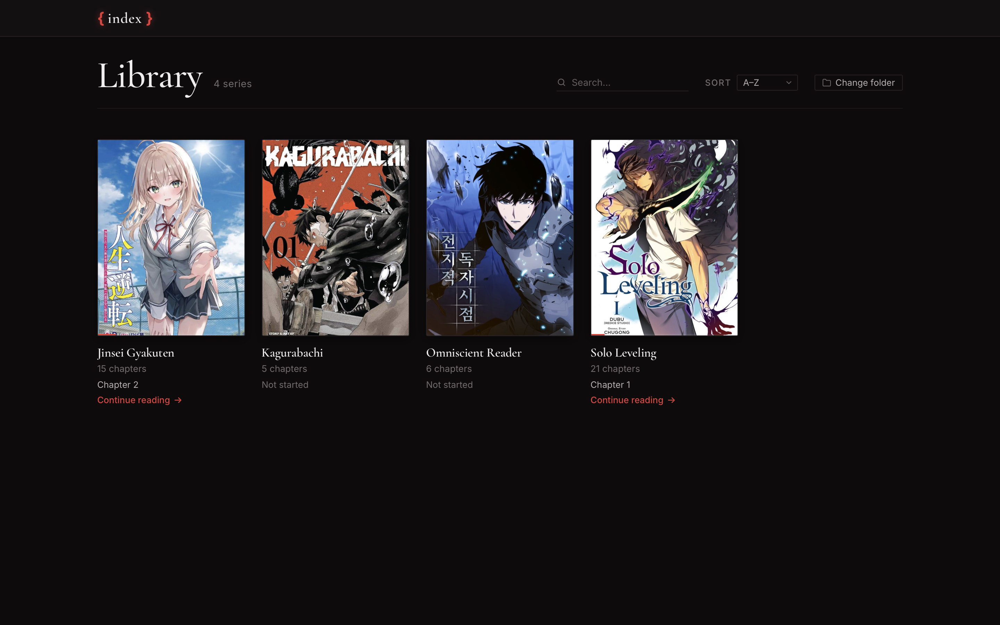
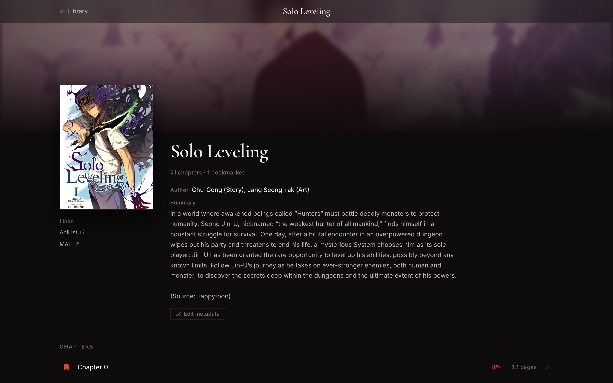
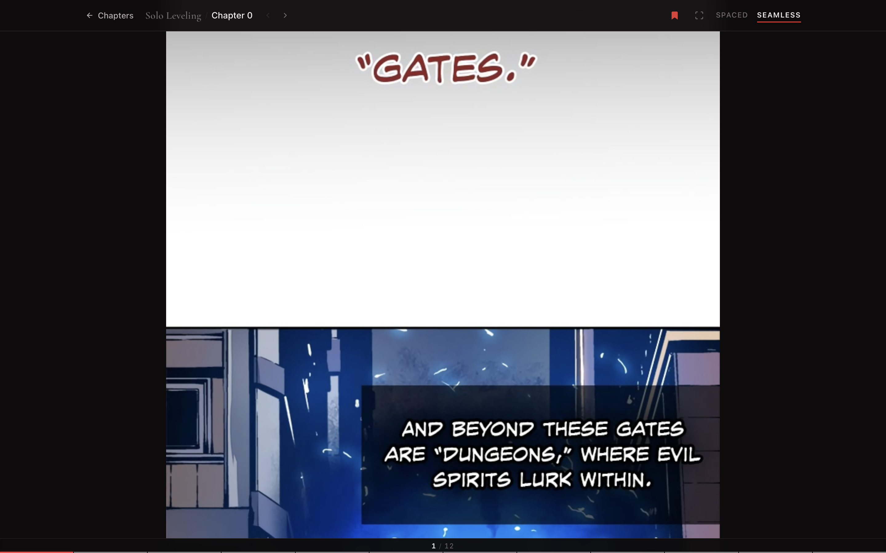
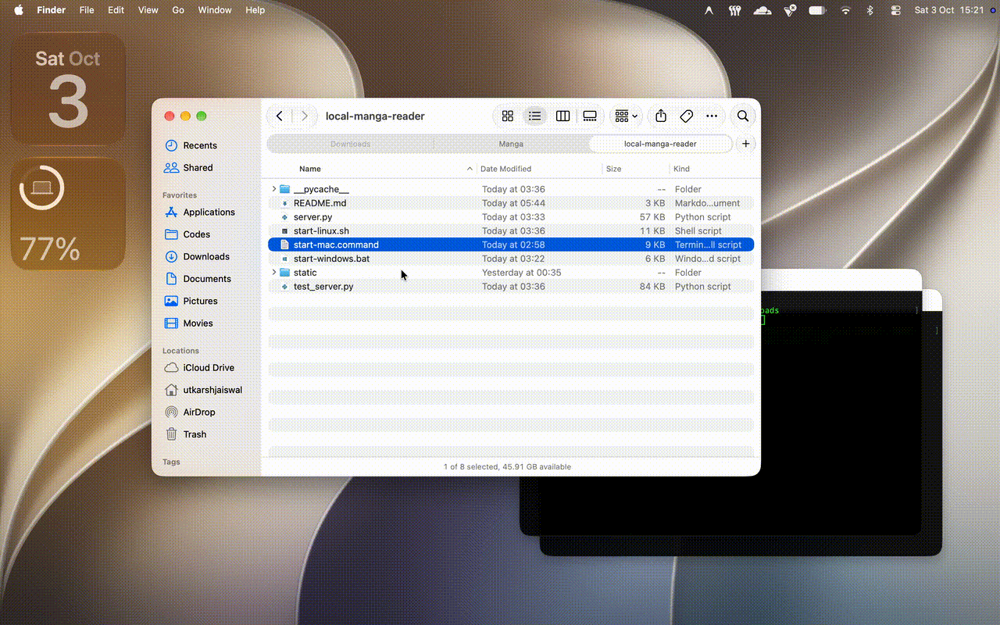

# { index }

A lightweight, zero-dependency local manga and manhwa reader that runs in your web browser.

## Features

- **Continuous Vertical Reading**: Smooth scrolling optimized for both traditional manga and webtoons/manhwa.
- **Spaced & Seamless Modes**: Switch between discrete pages with margins or a seamless edge-to-edge strip.
- **Folder & Archive Support**: Reads chapter folders directly alongside `.cbz` and `.zip` archives without extracting them.
- **Reading Progress & Resume**: Automatically saves your position as you scroll and resumes where you left off.
- **Segmented Timeline**: Interactive bottom progress bar with page previews and instant jump navigation.
- **Library Organization**: Instant search, unified sorting (by Name, Chapters, or Unread count), and chapter order toggle.
- **Series Customization**: Custom covers, hero backdrops, synopsis, and external links.
- **Dark Editorial Themes**: Minimalist Crimson and Kuromi dark themes with custom user profiles.
- **Keyboard Shortcuts**: Complete hands-free keyboard navigation.

## Preview









## Quick Start

### Prerequisites
- **Python 3.10+**
- A modern web browser
- No third-party packages or build steps required (`pip`, `npm`, etc. are not needed)

### Starting the App

- **macOS**: Double-click `start-mac.command`. It starts the server and opens the app in Safari.
- **Windows**: Double-click `start-windows.bat`. It starts the server and opens your default browser.
- **Linux**: Run `./start-linux.sh` in a terminal to launch the server and open your default browser.

#### Manual Startup
You can also start the server manually from any terminal:

```bash
python3 server.py
```

Once running, open your browser and navigate to:
```
http://localhost:8000
```

### First Launch
When opening the app for the first time without a configured library, it starts in a clean setup state. Simply click **Choose another folder** to select your manga folder.

## Manga Library Structure

Your manga folder can live anywhere on your computer (including external drives) and follows a simple structure:

```text
Manga/
├── Solo Leveling/
│   ├── cover.jpg           # (Optional) Custom cover
│   ├── background.jpg      # (Optional) Custom hero backdrop
│   ├── Chapter 01/         # Folder chapter containing images
│   │   ├── 001.jpg
│   │   ├── 002.jpg
│   │   └── ...
│   └── Chapter 02.cbz      # Archive chapter (.cbz or .zip)
└── Kagurabachi/
    ├── Chapter 01.zip
    └── Chapter 02.zip
```

- Each subfolder in your library represents a manga series.
- Chapters can be standard subfolders with images, `.cbz` files, or `.zip` archives.
- `cover.jpg` and `background.jpg` are optional. If omitted, covers are automatically generated from chapter pages.
- Reading progress, bookmarks, and metadata are saved per-series inside a hidden `.reader` folder.

## Changing Library Folder

You can choose or switch your manga library folder at any time directly inside the app:
- Click **Choose another folder** on the library screen, or open the profile menu and select a new folder.
- Your selection is remembered automatically for future launches.

## CLI Reference

You can pass command-line arguments when launching via `python3 server.py`:

```bash
# Start server with your saved library folder
python3 server.py

# Temporarily use another manga folder for this session only (does not change your saved library)
python3 server.py --dir /path/to/manga

# Run on a custom port
python3 server.py --port 9000

# View all options
python3 server.py --help
```

- `--dir <path>`: Temporarily overrides the active library for that server session without modifying your saved settings.
- `--port <port>`: Changes the port the server listens on (default: `8000`).

## Reading / Keyboard Shortcuts

### Reading Modes
- **Spaced Mode**: Adds spacing and subtle borders between pages, ideal for traditional Japanese manga.
- **Seamless Mode**: Strips all padding and borders for a continuous unbroken scroll, ideal for Korean manhwa and webtoons.

### Keyboard Shortcuts

| Key | Action |
| :--- | :--- |
| `Left` / `Page Up` | Go to previous chapter |
| `Right` / `Page Down` | Go to next chapter |
| `Home` | Scroll to top of chapter |
| `End` | Scroll to bottom of chapter |
| `F` | Toggle fullscreen |
| `B` | Toggle chapter bookmark |
| `S` | Switch reading style (Spaced ⟷ Seamless) |
| `Escape` | Exit fullscreen / close modal / back to series |

## Basic Troubleshooting

- **Python is not installed or version is too old**: Ensure Python 3.10 or higher is installed (`python3 --version`). You can download it from [python.org](https://www.python.org).
- **Launcher permission error (macOS / Linux)**: If the launcher script fails to run, make it executable in your terminal:
  - macOS: `chmod +x start-mac.command`
  - Linux: `chmod +x start-linux.sh`
- **Port already in use**: If port `8000` is being used by another application, run with a different port (e.g. `python3 server.py --port 8080`, or `PORT=8080 ./start-mac.command` on macOS).
- **Browser does not open automatically**: Open your browser manually and visit `http://localhost:8000`.

## Data & Privacy

- **Local & Private**: The reader runs entirely on your computer. Your manga files and reading data stay local.
- **Non-Destructive**: Your manga files and archives are never moved, renamed, extracted, or altered.
